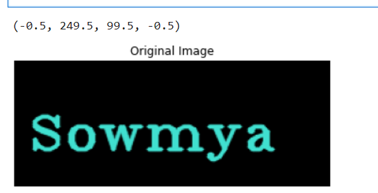
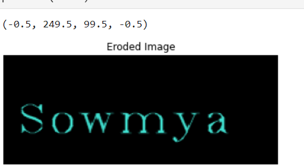
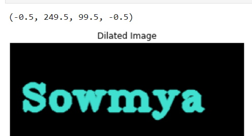

# Implementation-of-Erosion-and-Dilation
## Aim
To implement Erosion and Dilation using Python and OpenCV.
## Software Required
1. Anaconda - Python 3.7
2. OpenCV
## Algorithm:
### Step1:
Import the necessary packages.
### Step2:
Create the text image using cv2.putText().
### Step3:
Create the structuring kernel for image dilation and erosion.
### Step4:
Apply erosion and dilation using cv2.erode and cv2.dilate.
### Step5:
Plot the images using plt.imshow().
 
## Program:

```
Reg No. 212221230107
Developed by: M.Sowmya
```
# Import the necessary packages
```
import cv2
import numpy as np
from matplotlib import pyplot as plt
```
# Create the Text using cv2.putText
```
text_image = np.zeros((100,250),dtype = 'uint8')
img=cv2.cvtColor(text_image,cv2.COLOR_BGR2RGB)
font = cv2.FONT_HERSHEY_COMPLEX_SMALL
cv2.putText(img,"Sowmya",(10,70),font,2,(64,224,208),2,cv2.LINE_AA) 
plt.title("Original Image")
plt.imshow(img,'Blues')
plt.axis('off')
```
# Create the structuring element
```
kernel = cv2.getStructuringElement(cv2.MORPH_CROSS,(4,4))
```
# Erode the image
```
image_erode = cv2.erode(img,kernel)
plt.title("Eroded Image")
plt.imshow(image_erode,'Blues')
plt.axis('off')
```

# Dilate the image
```
image_dilate = cv2.dilate(img,kernel)
plt.title("Dilated Image")
plt.imshow(image_dilate,'Blues')
plt.axis('off')
```
## Output:

### Display the input Image


### Display the Eroded Image


### Display the Dilated Image

## Result
Thus the generated text image is eroded and dilated using python and OpenCV.